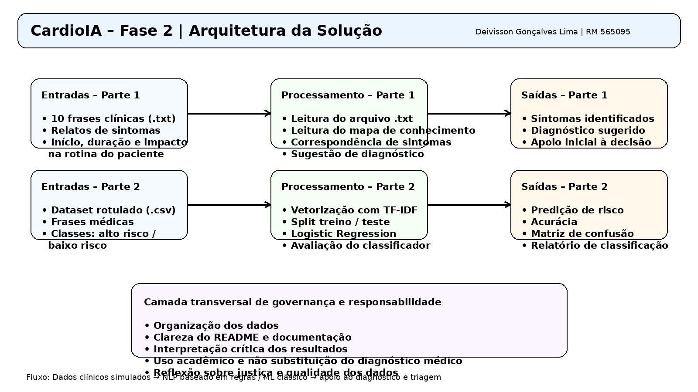

# CardioIA – Fase 2  
## Diagnóstico Automatizado – IA no Estetoscópio Digital

**Aluno:** Deivisson Gonçalves Lima  
**RM:** 565095  
**Curso:** 2TIAOA  

---

## Continuidade do Projeto

Esta entrega dá continuidade à **Fase 1** do projeto CardioIA, que está disponível no repositório:  
**Fase 1:** https://github.com/limadeivisson/cardioia-fase1-dados-cardiologicos

Nesta nova etapa, o foco foi desenvolver um módulo simples de apoio ao diagnóstico com IA, utilizando processamento de linguagem natural, associação entre sintomas e doenças e classificação básica de risco clínico.

---

## Objetivo da Fase 2

Desenvolver uma solução prática capaz de:

- Ler relatos textuais curtos de sintomas de pacientes;
- Identificar sintomas relevantes em frases clínicas;
- Associar sintomas a possíveis diagnósticos com base em um mapa de conhecimento;
- Classificar frases médicas em **alto risco** ou **baixo risco**;
- Simular uma triagem clínica automatizada com recursos acessíveis de IA.

---

## Estrutura do Projeto

```text
cardioia-fase2-diagnostico-automatizado/
│
├── README.md
├── requirements.txt
│
├── data/
│   ├── sintomas_pacientes.txt
│   ├── mapa_conhecimento_sintomas_doencas.csv
│   └── frases_risco_rotuladas.csv
│
├── scripts/
│   ├── parte1_extracao_sintomas.py
│   └── parte2_classificador_risco.py
│
├── notebooks/
│   ├── parte1_extracao_sintomas.ipynb
│   └── parte2_classificador_risco.ipynb
│
├── assets/
│   └── arquitetura_fase2_cardioia.png
│
└── docs/
    └── roteiro_video_fase2.md
```

---

## Parte 1 – Extração de Sintomas e Sugestão de Diagnóstico

### Arquivos utilizados
- `sintomas_pacientes.txt`
- `mapa_conhecimento_sintomas_doencas.csv`
- `parte1_extracao_sintomas.py`
- `parte1_extracao_sintomas.ipynb`

### Lógica aplicada
A solução lê frases simulando relatos de pacientes e procura sintomas por correspondência textual com base em um mapa de conhecimento. Quando encontra sintomas compatíveis, sugere um possível diagnóstico associado.

### Exemplo de funcionamento
**Frase:** “Estou com dor no braço esquerdo junto com pressão no peito.”  
**Sintomas encontrados:** dor no braço esquerdo, pressão no peito  
**Diagnóstico sugerido:** Infarto

---

## Parte 2 – Classificador Básico de Texto

### Arquivos utilizados
- `frases_risco_rotuladas.csv`
- `parte2_classificador_risco.py`
- `parte2_classificador_risco.ipynb`

### Etapas do processo
1. Leitura do dataset rotulado;
2. Transformação textual com **TF-IDF**;
3. Separação entre treino e teste;
4. Treinamento com **Logistic Regression**;
5. Avaliação por acurácia, matriz de confusão e relatório de classificação.

### Objetivo
Classificar frases médicas como:
- **alto risco**
- **baixo risco**

---

## Arquitetura da Solução

A imagem abaixo resume o fluxo geral do projeto:



---

## Como executar

### 1. Instalar dependências
```bash
pip install -r requirements.txt
```

### 2. Executar Parte 1
```bash
python scripts/parte1_extracao_sintomas.py
```

### 3. Executar Parte 2
```bash
python scripts/parte2_classificador_risco.py
```

---

## Resultados Esperados

### Parte 1
- Leitura de 10 frases clínicas;
- Identificação de sintomas;
- Sugestão automatizada de diagnóstico.

### Parte 2
- Vetorização com TF-IDF;
- Classificação de risco;
- Avaliação do modelo com métricas básicas.

---

## Vídeo Demonstrativo

**YouTube (não listado):**  
`[INSERIR LINK DO VÍDEO AQUI]`

---

## Conclusão

A Fase 2 do CardioIA demonstrou como técnicas simples de **NLP**, **representação vetorial de texto** e **Machine Learning clássico** podem ser aplicadas para simular etapas iniciais de apoio ao diagnóstico e triagem clínica.

Na Parte 1, foi construída uma lógica baseada em regras para sugerir diagnósticos a partir de sintomas relatados em linguagem natural. Na Parte 2, foi treinado um classificador básico de risco usando TF-IDF e regressão logística, reproduzindo de forma simplificada a lógica de sistemas reais de triagem automatizada.

Além do aspecto técnico, a atividade reforça a importância de dados bem estruturados, documentação clara e reflexão crítica sobre o uso de IA na saúde, especialmente no contexto de governança e responsabilidade em dados.

---

## Observação Final

Este projeto tem fins acadêmicos e demonstrativos. Ele **não substitui avaliação médica profissional**.
